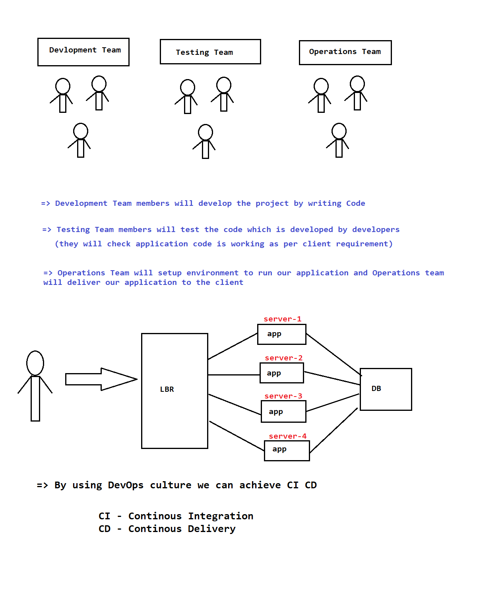

# **_What is DevOps?_**

<ol>
<li>DevOps is not a technology.</li>
<li>DevOps is not a programming language.</li>
<li>DevOps is a process / culture.</li>
<li>Now a days most of the companies are following this DevOps process/culture.</li>
<li>DevOps is a set of practices that combines software development and IT operation.</li>
<li>The main aim of the DevOps is to reduce software development life cycle period and deliver project to client quikly.</li>
<li>DevOps is a culture which is used to deliver the projects to the client quickly.
</li>
<li>DevOps means the colloboration between Devlopment and Operations.
 DevOps = Developmet + Operations
</li>
<li>Development team is responsible to write the code as per client requirements
.</li>
<li>Once development is completed then Operations team is responsible to deploy and deliver that project to the client
.</li>
<li>By Using DevOps process Development team & Operations team will work together to make sure project is getting delivered to client with in given estimated time.
</li>
</ol>

---

 
 

# **_What we need to learn to become devops engineer?_**

<ul>
<li>Linux Operating System.
<li>Shell Scripting</li>
<li>Cloud Computing ( AWS / Azure / GCP ). </li>
<li>DevOps Tools  
(Maven, GitHub, Jenkins, Sonar Qube, Docker, K8S, Ansible, Terraform, ELK)
</li>
</ul>

 

